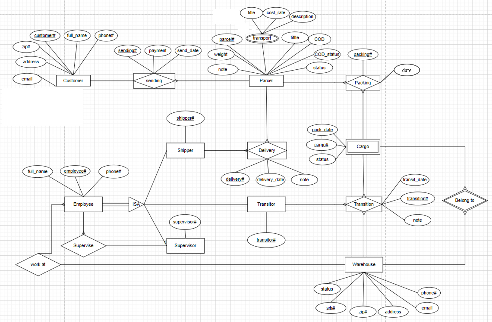

# Database design for a delivery company
## Introduction
The goal is to create a system that can manage orders, track deliveries, handle customer information, and ensure efficient operation of the delivery service. The database should include tables for customers, parcel, delivery personnel, ..., with relationships that accurately reflect the interactions between these entities.  
**Database: Oracel database 23ai**
## Delivery process

For the sake of simplity, we consider the delivery company as a network of warehouses, then the delivery of a parcel (package, ...) can be seen as a path in the graph.
1. Customers come to their nearest warehouse to send a parcel. They have to provide the basic information about them and their parcel, receiver, then select the transport type, and whether it includes COD.
2. Based on the location of the destination, we can calculate the shortest path from the current warehouse to the last warehouse which is the closest to the destination, and is the one to deliver the parcel to reveivers.
3. Given the determined route of a parcel, the ones with similar next stop are gathered into a cargo and then transitted to that next warehouse. The process's then repeated unitl a parcel reaches its last warehouse.
4. At the last warehouse, parcel are assigned to shipper for final delivery.
## ER Diagram

## Database schema
